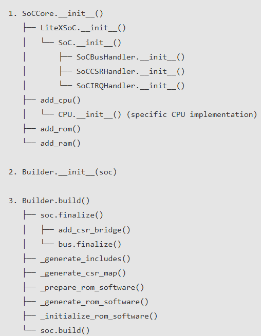
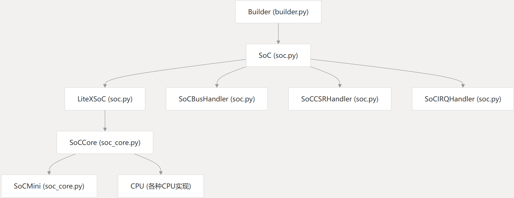

# How Generate a User-Defined SoC?

LiteX provides a Python-based framework for creating customized System-on-Chip (SoC) designs. The process of generating a user-defined SoC involves several key steps and components working together. 

The LiteX framework uses a hierarchical approach to create SoCs with the following key classes:
1. SoC - Base class for all SoCs (in litex/soc/integration/soc.py)
2. LiteXSoC - Extends SoC with additional functionality
3. SoCCore - Main SoC implementation that extends LiteXSoC
4. Builder - Handles the build process for SoCs

The typical flow for creating a SoC is:
1. Create a SoCCore instance with desired parameters
2. Add additional components as needed
3. Create a Builder instance with the SoC
4. Call the build() method on the Builder



## SoC创建流程

1. 初始化SoCCore：
* 创建一个SoCCore实例，指定平台、时钟频率、CPU类型等参数
* SoCCore初始化时会调用LiteXSoC.init，进而调用SoC.init
* SoC.__init__会创建SoCBusHandler、SoCCSRHandler和SoCIRQHandler

2. 添加CPU：
SoCCore.add_cpu()方法会创建指定类型的CPU实例
CPU实例会添加到总线系统中
CPU的中断和I/O区域会被配置

3. 添加内存：
SoCCore会添加ROM、SRAM和主RAM
这些内存会被添加到总线系统中

4. 添加外设：
添加UART、定时器等外设
外设会被添加到总线系统中

5. 完成SoC：
调用SoC.finalize()方法完成SoC配置
生成总线互连
配置中断系统

6. 构建SoC：
创建Builder实例
调用Builder.build()方法生成HDL和软件文件

## 如何生成自定义SoC

您可以使用SoCCore类直接创建SoC，也可以使用LiteXSoCGenerator类简化过程。无论使用哪种方法，LiteX都提供了丰富的选项，使您能够创建满足特定需求的自定义SoC。

## 1. SoC Definition

第一步，我们需要导入必要的模块并创建一个基本的SoC：

```python
from migen import *  
from litex.build.generic_platform import *  
from litex.soc.integration.soc_core import SoCCore  
from litex.soc.integration.builder import Builder  
from litex.soc.integration.soc import SoCRegion  
  
# 创建一个基本的SoC  
def create_soc(platform, **kwargs):  
    # 初始化SoCCore，这是LiteX SoC的核心类  
    soc = SoCCore(  
        platform=platform,           # FPGA平台  
        clk_freq=50e6,               # 时钟频率（50 MHz）  
        cpu_type="vexriscv",         # CPU类型  
        integrated_rom_size=0x8000,  # 32 KB ROM  
        integrated_sram_size=0x8000, # 32 KB SRAM  
        with_uart=True,              # 包含UART  
        with_timer=True,             # 包含定时器  
        **kwargs                     # 其他用户自定义参数  
    )  
    return soc
```
SoCCore类是LiteX中最重要的类之一，它继承自LiteXSoC类，并提供了创建SoC所需的基本功能。它的初始化方法接受许多参数，允许用户自定义SoC的各个方面。

## 2. 添加外设

第二步，添加SoC外设。
```python
# 添加自定义外设  
def add_custom_peripherals(soc):  
    # 添加SPI外设  
    from litex.soc.cores.spi import SPIMaster  
    spi = SPIMaster(  
        pads=platform.request("spi"),  
        data_width=8,  
        sys_clk_freq=soc.sys_clk_freq,  
        spi_clk_freq=1e6  
    )  
    soc.add_peripheral("spi", spi)  
      
    # 添加I2C外设  
    from litex.soc.cores.i2c import I2CMaster  
    i2c = I2CMaster(  
        pads=platform.request("i2c"),  
        sys_clk_freq=soc.sys_clk_freq  
    )  
    soc.add_peripheral("i2c", i2c)  
      
    return soc
```
add_peripheral方法用于向SoC添加外设，它实际上调用了add_slave方法，将外设添加为总线的从设备。

## 3. 构建SoC

第三步，使用Builder类来构建SoC。
```python
# 构建SoC  
def build_soc(soc, output_dir="build"):  
    builder = Builder(  
        soc=soc,                  # SoC实例  
        output_dir=output_dir,    # 输出目录  
        csr_csv="csr.csv",        # CSR映射文件  
        csr_json="csr.json",      # CSR映射文件（JSON格式）  
        compile_software=True,    # 编译软件  
        compile_gateware=True     # 编译硬件  
    )  
    builder.build()               # 执行构建过程  
    return builder
```
Builder类负责生成HDL文件、软件头文件和其他必要的组件。

## Builder构建过程

当您调用builder.build()时，LiteX会执行以下步骤：

1. 创建目录结构：创建输出目录、硬件目录和软件目录。

2. 生成软件包含文件：生成C头文件，定义SoC的内存映射、CSR寄存器等。

3. 生成CSR映射：生成CSV和JSON格式的CSR映射文件。 

4. 编译BIOS：如果SoC使用CPU，则编译BIOS。 

5. 构建硬件：生成HDL文件（Verilog或VHDL）。 

6. 生成文档（可选）：生成SoC的文档。

## 使用LiteX SoC生成器

LiteX还提供了一个更简单的方法来生成SoC，即使用`LiteXSoCGenerator`类。它封装了创建SoC的过程，使其更加简单。


# Python代码分析

SoC框架的核心类结构和调用关系如下：



`SoC` 类是 LiteX 框架中的核心类，用于构建和管理SoC设计。它继承自 `LiteXModule` 和 `SoCCoreCompat`，提供了丰富的方法来添加和管理SoC的各个组件：

1. 初始化总线系统(`SoCBusHandler`)
2. 初始化CSR处理器(`SoCCSRHandler`)
3. 初始化中断处理器(`SoCIRQHandler`)
4. 提供添加RAM、ROM、CPU和外设的方法
5. 管理内存映射和地址空间

`SoCBusHandler`类负责管理SoC的总线系统，包括主设备、从设备和内存区域：

1. 管理总线标准(Wishbone、AXI、AXI-Lite)
2. 处理总线互连(点对点、共享、交叉开关)
3. 管理内存区域和地址映射
4. 添加主设备和从设备

`LiteXSoC`继承自`SoC`类，扩展SoC类。`SoCCore`继承自`LiteXSoC`，是创建完整SoC的主要类，提供了默认的内存映射和更多预配置选项。

---

### **1. 类定义与初始化**

```python
class SoC(LiteXModule, SoCCoreCompat):
    mem_map = {}
    def __init__(self, platform, sys_clk_freq,
        bus_standard         = "wishbone",
        bus_data_width       = 32,
        bus_address_width    = 32,
        bus_timeout          = 1e6,
        bus_bursting         = False,
        bus_interconnect     = "shared",
        bus_reserved_regions = {},

        csr_data_width       = 32,
        csr_address_width    = 14,
        csr_paging           = 0x800,
        csr_ordering         = "big",
        csr_reserved_csrs    = {},

        irq_n_irqs           = 32,
        irq_reserved_irqs    = {},
        ):
```

#### **功能说明**
- **`platform`**: 表示目标硬件平台，提供与硬件相关的接口和资源。
- **`sys_clk_freq`**: 系统时钟频率，单位为 Hz。
- **`bus_standard`**: 总线标准，默认为 `"wishbone"`，支持 `"axi-lite"` 和 `"axi"`。
- **`bus_data_width`**: 总线数据宽度，默认为 32 位。
- **`bus_address_width`**: 总线地址宽度，默认为 32 位。
- **`bus_timeout`**: 总线超时时间，默认为 1e6。
- **`bus_bursting`**: 是否启用总线突发传输，默认为 `False`。
- **`bus_interconnect`**: 总线互连方式，默认为 `"shared"`。
- **`bus_reserved_regions`**: 保留的总线区域，用于定义特殊内存区域。
- **`csr_data_width`**: CSR（控制和状态寄存器）数据宽度，默认为 32 位。
- **`csr_address_width`**: CSR 地址宽度，默认为 14 位。
- **`csr_paging`**: CSR 分页大小，默认为 0x800。
- **`csr_ordering`**: CSR 字节序，默认为 `"big"`。
- **`csr_reserved_csrs`**: 保留的 CSR 区域。
- **`irq_n_irqs`**: 中断请求（IRQ）的数量，默认为 32。
- **`irq_reserved_irqs`**: 保留的中断请求。

---

### **2. 初始化日志**

---

### **3. 初始化 SoC 属性**
```python
self.platform     = platform
self.sys_clk_freq = int(sys_clk_freq)
self.constants    = {}
self.csr_regions  = {}
```

#### **功能说明**
- **`platform`**: 存储目标硬件平台。
- **`sys_clk_freq`**: 存储系统时钟频率。
- **`constants`**: 用于存储 SoC 的常量。
- **`csr_regions`**: 用于存储 CSR 区域。

---

### **4. 设置顶层模块**
```python
LiteXContext.top = self
```

#### **功能说明**
- 将当前 SoC 实例设置为 LiteX 上下文中的顶层模块。

---

### **5. 初始化SoCBusHandler**
- 创建并初始化 `SoCBusHandler` 实例，用于管理 SoC 的总线。


---

### **6. 初始化 CSR 处理器**
- 创建并初始化 `SoCCSRHandler` 实例，用于管理 SoC 的 CSR 区域。
```python
self.csr = SoCCSRHandler(
    data_width    = csr_data_width,
    address_width = csr_address_width,
    alignment     = 32,
    paging        = csr_paging,
    ordering      = csr_ordering,
    reserved_csrs = csr_reserved_csrs,
)
```

---

### **7. 初始化 IRQ 处理器**
- 创建并初始化 `SoCIRQHandler` 实例，用于管理 SoC 的中断请求。
```python
self.irq = SoCIRQHandler(
    n_irqs        = irq_n_irqs,
    reserved_irqs = irq_reserved_irqs
)
```


---

### **8. 打印初始 SoC 信息**
```python
self.logger.info(colorer("-"*80, color="bright"))
self.logger.info(colorer("Initial SoC:"))
self.logger.info(colorer("-"*80, color="bright"))
self.logger.info(self.bus)
self.logger.info(self.csr)
self.logger.info(self.irq)
self.logger.info(colorer("-"*80, color="bright"))
```

#### **功能说明**
- 打印 SoC 的初始信息，包括总线、CSR 和 IRQ 的配置。

---

### **9. 主要方法**
`SoC` 类提供了许多方法来添加和管理 SoC 的各个组件，例如：

#### **`add_cpu`**
- 添加 CPU 到 SoC，支持多种 CPU 类型和变体。

`add_cpu` 是 `SoC` 类中的一个方法，用于向 SoC 设计中添加 CPU。它支持多种 CPU 类型和变体，并负责配置 CPU 的相关参数，如复位地址、中断处理、总线连接等。以下是 `add_cpu` 方法的详细解释：

---

### **方法签名**
```python
def add_cpu(self, name="vexriscv", variant="standard", reset_address=None, cfu=None):
```

#### **参数说明**
- **`name`**: CPU 的名称，默认为 `"vexriscv"`。LiteX 支持多种 CPU，如 `"vexriscv"`、`"picorv32"`、`"rocket"` 等。
- **`variant`**: CPU 的变体，默认为 `"standard"`。不同 CPU 可能有不同的变体，例如 `"minimal"`、`"full"` 等。
- **`reset_address`**: CPU 的复位地址，默认为 `None`。如果未指定，将使用 SoC 的 ROM 区域的起始地址。
- **`cfu`**: 可选参数，用于指定 CFU（Custom Function Unit）文件路径，用于扩展 CPU 功能。

---

### **方法功能**
1. **检查 CPU 是否支持**:
   - 首先，方法会检查 `name` 是否在 LiteX 支持的 CPU 列表中。如果不支持，会抛出错误并列出所有支持的 CPU。
   ```python
   if name not in cpu.CPUS.keys():
       self.logger.error("{} CPU {}, supported are: \n{}".format(
           colorer(name),
           colorer("not supported", color="red"),
           colorer("\n".join(supported_cpus))))
       raise SoCError()
   ```

2. **检查 CPU 变体是否支持**:
   - 如果指定的 `variant` 不在 CPU 支持的变体列表中，会抛出错误并列出所有支持的变体。
   ```python
   if (variant not in cpu_cls.variants) and (cpu_cls is not cpu.CPUNone):
       self.logger.error("{} CPU variant {}, supported are: \n - {}".format(
           colorer(variant),
           colorer("not supported", color="red"),
           colorer("\n - ".join(sorted(cpu_cls.variants)))))
       raise SoCError()
   ```

3. **添加 CPU 到 SoC**:
   - 根据 `name` 和 `variant` 创建 CPU 实例，并将其添加到 SoC 中。
   ```python
   self.cpu = cpu_cls(self.platform, variant)
   self.logger.info("CPU {} {}.".format(
       colorer(name, color="underline"),
       colorer("added", color="green")))
   ```

4. **配置 CPU 的复位地址**:
   - 如果未指定 `reset_address`，则使用 SoC 的 ROM 区域的起始地址作为 CPU 的复位地址。
   ```python
   if reset_address is None:
       reset_address = self.mem_map["rom"]
   self.cpu.set_reset_address(reset_address)
   ```

5. **添加 CPU 的总线主设备**:
   - 将 CPU 的总线主设备连接到 SoC 的总线。
   ```python
   for n, cpu_bus in enumerate(self.cpu.periph_buses):
       self.bus.add_master(name="cpu_bus{}".format(n), master=cpu_bus)
   ```

6. **配置 CPU 的中断**:
   - 如果 CPU 支持中断，则启用 SoC 的中断处理器，并将 CPU 的中断连接到 SoC 的中断系统。
   ```python
   if hasattr(self.cpu, "interrupt"):
       self.irq.enable()
       for irq_name, loc in self.cpu.interrupts.items():
           self.irq.add(irq_name, loc)
   ```

7. **配置 CPU 的 DMA 总线**:
   - 如果 CPU 支持 DMA 总线，则创建并配置 DMA 总线。
   ```python
   if hasattr(self.cpu, "dma_bus"):
       self.dma_bus = SoCBusHandler(
           name             = "SoCDMABusHandler",
           standard         = dma_bus_standard,
           data_width       = self.cpu.dma_bus.data_width,
           address_width    = self.cpu.dma_bus.address_width,
           bursting         = self.cpu.dma_bus.bursting
       )
   ```

8. **添加 CPU 的 SoC 组件**:
   - 如果 CPU 有额外的 SoC 组件（如缓存、MMU 等），则将其添加到 SoC 中。
   ```python
   if hasattr(self.cpu, "add_soc_components"):
       self.cpu.add_soc_components(soc=self)
   ```

9. **添加 CPU 相关的常量**:
   - 将 CPU 的类型、变体、名称等信息作为常量添加到 SoC 中，供软件使用。
   ```python
   self.add_config(f"CPU_TYPE_{name}")
   self.add_config(f"CPU_VARIANT_{str(variant.split('+')[0])}")
   self.add_config("CPU_FAMILY",     getattr(self.cpu, "family",     "Unknown"))
   self.add_config("CPU_NAME",       getattr(self.cpu, "name",       "Unknown"))
   self.add_config("CPU_HUMAN_NAME", getattr(self.cpu, "human_name", "Unknown"))
   ```

---

### **总结**
`add_cpu` 方法的主要功能是向 SoC 设计中添加 CPU，并配置其相关参数，如复位地址、总线连接、中断处理等。它支持多种 CPU 类型和变体，并提供了灵活的配置选项，使得用户可以根据需求定制 SoC 的 CPU 部分。


#### **add_ram**
- 添加 RAM 到 SoC，支持配置起始地址、大小和内容。

#### **add_rom**
- 添加 ROM 到 SoC，支持配置起始地址、大小和内容。

#### **add_timer**
- 添加定时器到 SoC，用于时间管理。

#### **add_uart**
- 添加 UART 到 SoC，用于串行通信。

#### **add_ethernet**
- 添加以太网控制器到 SoC，支持网络通信。

#### **finalize**
- 最终化 SoC 设计，完成所有组件的连接和配置。

#### **build**
- 构建 SoC，生成硬件描述文件（如 Verilog）和软件固件。

