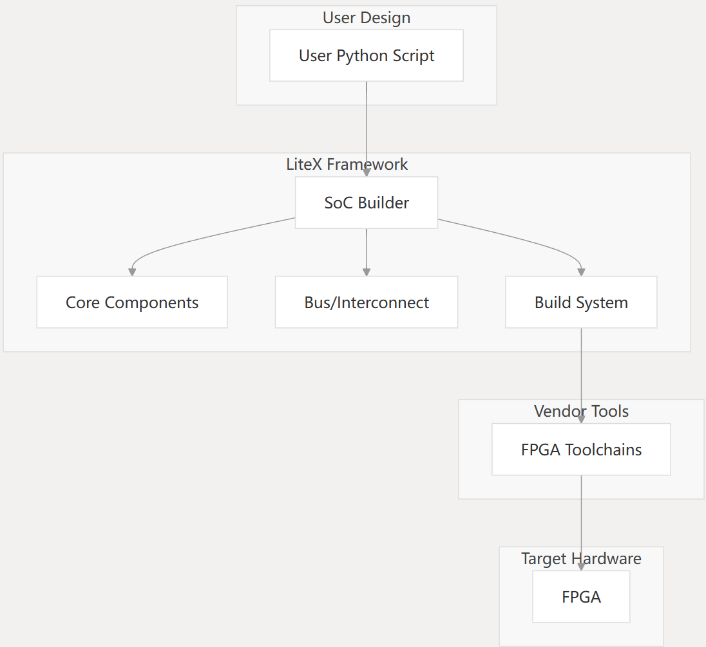

# Chip Copilot

We are an open-source Python-based SoC (System on Chip) builder framework designed to simplify FPGA development. It provides a flexible and modular architecture that allows developers to create custom digital designs ranging from simple controllers to complex, CPU-based systems. This introduction provides an overview of LiteX's purpose, architecture, and core components.

Chip-Copilot leverages several Python-based HDL frameworks to enable hardware description in Python. The SoC is generated using a custom generator written in Python, primarily leveraging migen, which pulls together the CPU, peripherals, PAD, clock/reset tree, and creates the address mapping and the platform-support files needed to compile software for the core.

Chip-Copilot addresses key challenges in modern SoC design:

1) Comprehensive IP description - Uses Python to represent any potential IP adequately
2) Connectivity description - Defines clear methods to describe connections between IPs, buses, and masters
3) Code generation - Generates proper format and connections for all Verilog modules
4) Efficiency - Maintains acceptable runtime while ensuring flexibility
5) Usability - Achieves "no-man-in-the-loop" automation while providing access to intermediate files
6) Quality - Avoids compromising work quality compared to manual design processes

Chip-Copilot provides a framework for agile SoC design using Python. It addresses the challenges of modern hardware design by:

1) Enabling a 100% Python-based design environment
2) Implementing agile hardware development principles
3) Leveraging existing open-source tools and generators
4) Following the "Reuse, Modularize, Automate" strategy

The framework is designed to handle integration of complex SoCs, with support for various CPU cores, peripherals, and custom IP blocks, all described and generated using Python.

## What is SoC Copilot

LiteX offers a comprehensive framework for designing and implementing digital systems on FPGAs. It was initially developed by Enjoy-Digital to create customer projects, and has evolved into a versatile open-source ecosystem embraced by a wide community of developers.

At its core, LiteX is a tool that enables you to:

1. Define your hardware in Python using the Migen HDL library
2. Integrate various IP cores from the LiteX ecosystem
3. Connect these components using standardized buses and interfaces
4. Generate HDL code (Verilog/VHDL) for FPGA implementation
5. Build and flash designs to supported FPGA boards
6. Debug and interact with your designs through various interfaces
   
LiteX's approach of using Python to generate hardware description allows for greater expressiveness and flexibility compared to traditional HDL approaches.

**Architecture Overview** 

LiteX follows a modular architecture that separates concerns into different layers and components.

**High-Level Architecture**

LiteX is organized into several sub-packages:

1. **litex.gen**: Provides specific or experimental modules to generate HDL not integrated in [Migen]()
2. **litex.build**: Tools to build FPGA bitstreams and simulate HDL code or full SoCs
3. **litex.soc**: Definitions and modules to build cores, buses, and complete SoCs

**Ecosystem**

The diagram shows the relationship between LiteX's core SoC builder and the ecosystem of IP cores, CPU support, and board definitions that can be used to create complete designs.

**Design Flow**

LiteX implements a design flow that takes you from Python code to a running FPGA system:

The flow shows how LiteX takes your Python description of a SoC and transforms it into both hardware (bitstream) and software (firmware) components that work together on the target FPGA.

**SoC Construction**

At the center of LiteX is the SoC (System on Chip) design methodology. The SoC is constructed by:

This diagram shows how the various components of a SoC in LiteX are defined and connected, then processed through the build system to create a functional design.

**Key Features**

LiteX offers a wide range of features to simplify FPGA development:

1. **Python-Based Development**

* Hardware definition in Python using Migen
* Flexible and expressive hardware construction
* Parametrizable designs

2. **Rich Ecosystem**

* Comprehensive IP core library
* Support for various CPU architectures
* Peripheral integration

3. **Bus Systems**

* Wishbone
* AXI/AXI-Lite
* Avalon-ST
* Custom interconnects

4. Simulation Support
   
* Direct simulation through Verilator
* Test infrastructure

5. Cross-Vendor Support

* Xilinx
* Intel/Altera
* Lattice
* Other FPGA vendors

6. Extensibility

* Integration with existing HDL (Verilog/VHDL)
* Custom core development

## Key Features

This page provides an overview of the core capabilities and features of the LiteX framework. LiteX is a powerful SoC builder framework that enables hardware designers to create FPGA-based systems using Python.

**Overview**

LiteX provides a comprehensive set of components and tools for creating FPGA-based System-on-Chip (SoC) designs. It allows developers to describe hardware in Python, which is then transformed into RTL (Verilog/VHDL) for FPGA implementation.

**Bus and Interconnect Systems**

LiteX provides flexible bus systems that serve as the backbone of SoC designs. The framework supports multiple standard bus protocols:

* Wishbone: A simple, synchronous bus with master/slave architecture
* AXI/AXI-Lite: AMBA Advanced eXtensible Interface for high-performance connections
* Avalon-ST: Intel/Altera's Avalon Streaming Interface
* CSR (Control & Status Registers): Simple memory-mapped register interface for peripherals

LiteX includes components for bus conversions, address decoding, clock domain crossing, and interconnect implementations (shared bus, crossbar).

**CPU Support**

LiteX supports integration with various CPU architectures and cores, enabling designers to choose the best processor for their specific needs.

Supported CPU architectures include:

RISC-V cores: VexRiscv, VexRiscvSMP, NaxRiscv, Rocket, Minerva, PicoRV32, CVA5, CVA6, Ibex
OpenRISC cores: Mor1kx, Marocchino
Other architectures: LM32, PowerPC (Microwatt), ARM (ZynqMP, Zynq7000)

The framework provides a standardized CPU interface that handles memory mapping, interrupt control, and bus connection.

**Peripheral Support**

LiteX includes a rich set of built-in peripherals and access to an extensive ecosystem of additional peripheral cores:

Basic peripherals:
UART (Serial communication)
I2C
SPI
GPIO
PWM
Timers
JTAG
LED controllers
Watchdog

Advanced peripherals (through ecosystem):
Networking: Ethernet (LiteEth)
Storage: SATA (LiteSATA), SD Card (LiteSDCard), SPI Flash (LiteSPI)
High-speed I/O: PCIe (LitePCIe)
Memory: DRAM (LiteDRAM), HyperRAM
Video: HDMI, framebuffers, VTG
JESD204B: High-speed serial interfaces (LiteJESD204B)

**Simulation Support**

LiteX provides comprehensive simulation capabilities to validate SoC designs before implementation:

Verilator integration: Fast C++ based HDL simulation
GHDL support: VHDL simulation
Icarus Verilog: Verilog simulation
Integrated testbenches: For core validation
Software simulation: Python-based behavioral models
The simulation infrastructure allows:

Full SoC simulation with CPU and peripherals
Ethernet/PCIe/DRAM/etc. device models
Running software on simulated CPUs
Console interaction with simulated SoC
Waveform generation and analysis

# CPU Packages

CPU data packages are an essential component of the Chip-Copilot ecosystem, providing hardware designers with access to pre-built RISC-V CPU cores that can be easily integrated into System-on-Chip (SoC) designs using Python-based tools.

These packages deliver ready-to-use RISC-V core implementations in Verilog format, packaged as Python modules for easy integration into Python-based SoC design flows. This page focuses on the general structure, purpose, and usage patterns common to all CPU data packages. For specific details about individual CPU implementations, see [VexRISCV CPU Package]().

